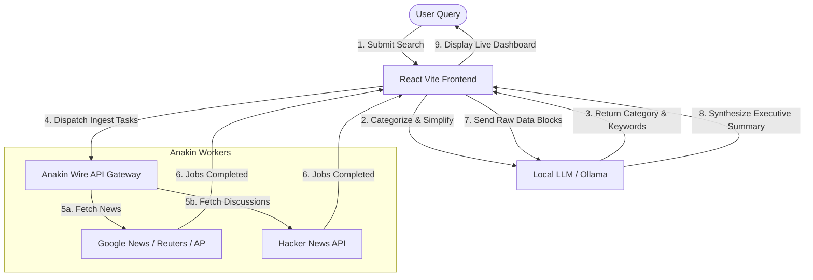

# Veritas Hackathon Submission & Demo Kit

This document contains your tailored social media post drafts, the step-by-step flow breakdown to design your architecture diagram, and a comprehensive 3+ minute demo video script.

---

## 📱 Social Media Post Drafts

### Option 1: X (Twitter) — *Concise & Catchy*
> Ingesting news is easy; measuring bias & sentiment divergence is where the real truth lies. 
> 
> Introducing **Veritas** — an AI-powered intelligence dashboard that analyzes global news & public opinion in real-time. Built with a two-step Local LLM (Ollama/LM Studio) orchestration pipeline and powered by @anakinHQ's parallel Wire API search workers. 
> 
> Bypassing social API restrictions to ingest live Hacker News & mainstream media, classifying intent locally, and running private synthesis models. 🚀
> 
> #Hackathon #LocalAI #AnakinWire #OpenSource #GenerativeAI

***

### Option 2: LinkedIn — *Professional & Technical*
> 🔍 **Unveiling Veritas: Local AI & Live Web Ingestion for Real-Time Sentiment Divergence Analysis**
> 
> Mainstream media tells one story; public discussions tell another. Veritas bridges this gap by aggregating global media coverage alongside public forums (Hacker News) to calculate a "Divergence Score" and synthesize objective, private summaries.
> 
> **How it works under the hood:**
> 1️⃣ **Local Intent Classification**: Processes the user query locally using Ollama/LM Studio to categorize intent (Tech, Finance, Politics, Careers, etc.) and extract simplified search terms.
> 2️⃣ **Parallel API Dispatch**: Leverages the Anakin Wire API to execute search queries across verified news and discussion nodes concurrently.
> 3️⃣ **Asynchronous Job Polling**: Features an async polling loop that processes nested JSON outputs from separate API tasks in parallel.
> 4️⃣ **Private LLM Synthesis**: Aggregates raw text payloads and feeds them back to a local model to compile a non-biased, source-referenced executive summary.
> 
> Special thanks to the team at **Anakin** (LinkedIn: @anakintech) for providing the high-speed Wire APIs that make live ingestion seamless. 
> 
> #Buildathon #ArtificialIntelligence #SoftwareEngineering #Llama3 #DeveloperCommunity #TechShowcase

---

## 🗺️ Architecture & Flow Diagram Guide

Use these points to draw your architecture diagram (e.g., in Figma, Miro, or Mermaid):

### Text Explanation of the Flow:
1. **Input Stage**: The user submits a search query (e.g., *"Will CS engineers get placed?"*) on the React + Vite UI.
2. **Intent Classification & Query Simplification (Local)**: The frontend calls the local LLM (Ollama or LM Studio) to classify the query type and strip out fluff words, transforming a long question into clean search keywords (e.g., `"computer science placement"`).
3. **Task Orchestration**: The frontend selects the appropriate Anakin Wire Action IDs based on the query category and dispatches them in parallel to the Anakin Wire endpoints.
4. **Asynchronous Ingestion**: The frontend initiates concurrent polling workers for each dispatched task, monitoring progress and gracefully recovering from individual API failures.
5. **Data Mapping & Sentiment Engine**: Raw nested JSONs from completed jobs are mapped to standard data types. The client calculates engagement metrics and performs keyword-based sentiment tagging.
6. **Executive Summary Synthesis (Local)**: The normalized live context is fed back to the local LLM (with a Gemini API fallback) to synthesize an objective, multi-point executive summary.
7. **Interactive UI Display**: The dashboard displays the live Media Coverage, Public Opinions, Divergence Indexes, and the interactive Wire Ingest Payload Inspector.

---

## 🎬 3-Minute Demo Video Script

*This script is written for a recorded screencast of the dashboard. Total estimated run time: 3 minutes (approx. 420 words spoken at a steady, engaging pace).*

| Time | Visual / Action | Speech / Voiceover |
| :--- | :--- | :--- |
| **0:00 - 0:30** | Show the Veritas Landing Page. Input a complex query like: *"Is Python Language Widely Accepted By Developers?"* and click Search. Hover over the loading animation. | `"Hi everyone! Welcome to Veritas. Today, we are facing an information paradox: media outlets write formal articles, while public communities hold raw, unstructured discussions. Finding the real truth requires reading both. Veritas is an AI-powered intelligence platform that analyzes real-time mainstream news against community opinions to give you an objective view, powered by local LLMs and Anakin Wire's live web ingestion."` |
| **0:30 - 1:15** | Transition to the Dashboard. Point out the **Executive Summary**, the **Divergence Score (72/100)**, and the **Source Diversity**. | `"Once we enter our search query, Veritas immediately goes to work. Right at the top, you see our AI-Generated Executive Summary. This isn't static text—it's synthesized on the fly from live web results. Below it, our Divergence Score measures how much public opinion differs from media coverage. If news outlets are hyping a technology but developers on forums are complaining about bugs, Veritas detects this bias immediately, supported by a diverse count of independent domains."` |
| **1:15 - 2:00** | Click on the **Media Coverage** tab, scroll through the live headlines. Then, click on the **Public Opinion** tab, showing the live Hacker News discussions with usernames and engagement scores. | `"Let's look at the data streams. In the Media Coverage tab, we ingest stories from Google News, Reuters, and AP. In the Public Opinion tab, we run live scrapers to aggregate community discussions. Because traditional scrapers suffer from authentication limits, we integrated Hacker News via Anakin's APIs to pull real developer discussions, titles, points, and authors. We dynamically simplify complex natural language questions into clean search queries so we never get empty results."` |
| **2:00 - 2:40** | Click the **"Inspect Wire API Ingest Payload"** button to open the modal. Scroll through the code block showing the raw JSON payload. | `"To ensure full transparency—crucial for an intelligence tool—we built the Wire Ingest Payload Inspector. Clicking this exposes the exact JSON payloads fetched from Anakin's API. You can see the raw headers, job status polling metrics, and the raw parsed inputs. Veritas is completely LLM-agnostic: it runs intent classification and summary synthesis on a local model like Qwen 2.5 or Llama 3 via Ollama, and displays the active model name right here in the header."` |
| **2:40 - 3:00** | Zoom in slightly on the header showing the model name and the clean, dark-mode/glassmorphism UI. Move back to the landing page. | `"Veritas proves that you can run privacy-first, local AI intelligence combined with high-speed, live parallel web harvesting without compromising performance or UI aesthetics. Thank you to the Anakin team for the robust Wire APIs, and thank you for watching the Veritas demo!"` |
